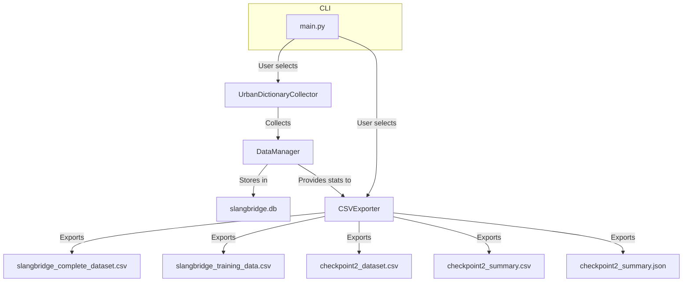

# SlangBridge: Urban Dictionary Slang Data Collector

## Overview

SlangBridge is a Python-based toolkit for collecting, processing, and exporting slang terms and their standard translations, primarily from Urban Dictionary. It supports data collection, storage in SQLite, and export to CSV for machine learning and reporting.

---

## Repository Structure & File Descriptions

```
.gitignore
llama_client.py
main.py
README.md
slang_lookup.py
web_scraper.py
urbanDict/
    checkpoint2_dataset.csv
    checkpoint2_summary.csv
    checkpoint2_summary.json
    slangbridge_complete_dataset.csv
    slangbridge_training_data.csv
    slangbridge.db
    urban_dictionary_only.py
```

### Top-Level Files

- **.gitignore**  
  Standard gitignore file for Python and data artifacts.

- **llama_client.py**  
  (Not fully detailed) Presumably a client for interacting with Llama-based language models.

- **main.py**  
  Main entry point for running the application. Handles user interaction and orchestrates data collection and export.

- **README.md**  
  This documentation file.

- **slang_lookup.py**  
  (Not fully detailed) Likely provides lookup utilities for slang terms.

- **web_scraper.py**  
  (Not fully detailed) Likely contains generic web scraping utilities.

### `urbanDict/` Directory

- **urban_dictionary_only.py**  
  The core script for collecting slang data from Urban Dictionary, managing the SQLite database, and exporting data to CSV.  
  - Contains:
    - `UrbanDictionaryCollector`: Collects slang/standard pairs.
    - `DataManager`: Handles SQLite storage and statistics.
    - `CSVExporter`: Exports data in various formats.
    - Export/report functions for checkpointing and ML training.
    - CLI for running different collection/export modes.

- **slangbridge.db**  
  SQLite database storing all collected slang/standard pairs and raw data.

- **slangbridge_complete_dataset.csv**  
  Exported CSV of all collected data, including metadata.

- **slangbridge_training_data.csv**  
  Exported CSV in a format suitable for ML training (input/target pairs, direction, features).

- **checkpoint2_dataset.csv**  
  Exported CSV for checkpoint reporting, with additional features and categories.

- **checkpoint2_summary.csv**  
  CSV summary statistics for the checkpoint dataset.

- **checkpoint2_summary.json**  
  JSON summary statistics for the checkpoint dataset.

---

## How to Operate `main.py`

1. **Run the Script**

   ```sh
   python main.py
   ```

2. **Choose an Option**

   The script will prompt you to select a collection or export mode:
   ```
   1. Quick test (5 terms)
   2. Standard collection (50+ terms + random)
   3. MEGA collection (200+ terms + 300 random)
   4. Export existing data to CSV
   ```

   - Enter `1`, `2`, or `3` to collect new data (with increasing size).
   - After collection, you can choose to export the data to CSV.
   - Enter `4` to export all existing data in the database to CSV files.

3. **Output**

   - CSV files will be generated in the `urbanDict/` directory.
   - Main files for checkpoint/reporting:
     - `checkpoint2_dataset.csv`
     - `checkpoint2_summary.csv`
     - `checkpoint2_summary.json`

---

## Architecture Schema



- **UrbanDictionaryCollector**: Fetches slang/standard pairs from Urban Dictionary.
- **DataManager**: Handles database operations and statistics.
- **CSVExporter**: Exports data in various formats for ML and reporting.
- **main.py**: CLI entry point for user interaction.

---

## Notes

- All data is stored in `urbanDict/slangbridge.db`.
- Exported CSVs are in `urbanDict/`.
- For more details, see [urbanDict/urban_dictionary_only.py](urbanDict/urban_dictionary_only.py)